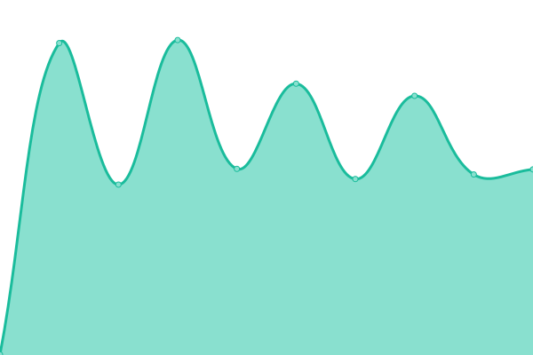
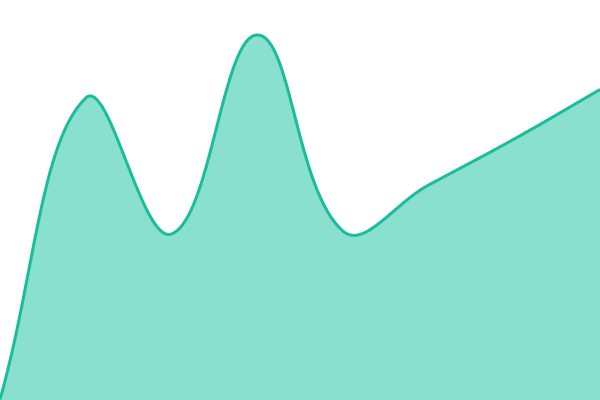

# [📈 Live Status](https://juangravano.github.io/statuspage): <!--live status--> **🟥 Complete outage**

This repository contains the open-source uptime monitor and status page for [ju4ncite](juan.software), powered by [Upptime](https://github.com/upptime/upptime).

With [Upptime](https://upptime.js.org), you can get your own unlimited and free uptime monitor and status page, powered entirely by a GitHub repository. We use [Issues](https://github.com/juangravano/statuspage/issues) as incident reports, [Actions](https://github.com/juangravano/statuspage/actions) as uptime monitors, and [Pages](https://juangravano.github.io/statuspage) for the status page.

<!--start: status pages-->
<!-- This summary is generated by Upptime (https://github.com/upptime/upptime) -->
<!-- Do not edit this manually, your changes will be overwritten -->
<!-- prettier-ignore -->
| URL | Status | History | Response Time | Uptime |
| --- | ------ | ------- | ------------- | ------ |
|  [wtw](https://affinitytechnology.willistowerswatson.com/salesv2/?sname=uala&uid=da83b849-37eb-4d65-ba7b-813b5bd401da) | 🟥 Down | [wtw.yml](https://github.com/juangravano/statuspage/commits/HEAD/history/wtw.yml) | 

 408ms
     
 | 

<a href="https://wtw.juan.software/history/wtw">98.42%</a>
    

|  [wtw - salud](https://affinitytechnology.willistowerswatson.com/salesv2/home/new-quote?sname=uala&pid=498&uid=da83b849-37eb-4d65-ba7b-813b5bd401da) | 🟥 Down | [wtw-salud.yml](https://github.com/juangravano/statuspage/commits/HEAD/history/wtw-salud.yml) | 

 392ms
     
 | 

<a href="https://wtw.juan.software/history/wtw-salud">98.42%</a>
    

|  [wtw - celular](https://affinitytechnology.willistowerswatson.com/salesv2/home/new-quote?sname=uala&pid=494&uid=da83b849-37eb-4d65-ba7b-813b5bd401da) | 🟥 Down | [wtw-celular.yml](https://github.com/juangravano/statuspage/commits/HEAD/history/wtw-celular.yml) | 

 384ms
     
 | 

<a href="https://wtw.juan.software/history/wtw-celular">98.43%</a>
    

|  [wtw - hogar](https://affinitytechnology.willistowerswatson.com/salesv2/home/new-quote?sname=uala&pid=495&uid=da83b849-37eb-4d65-ba7b-813b5bd401da) | 🟥 Down | [wtw-hogar.yml](https://github.com/juangravano/statuspage/commits/HEAD/history/wtw-hogar.yml) | 

 409ms
     
 | 

<a href="https://wtw.juan.software/history/wtw-hogar">98.43%</a>
    

|  [wtw - mascota](https://affinitytechnology.willistowerswatson.com/salesv2/home/new-quote?sname=uala&pid=496&uid=da83b849-37eb-4d65-ba7b-813b5bd401da) | 🟥 Down | [wtw-mascota.yml](https://github.com/juangravano/statuspage/commits/HEAD/history/wtw-mascota.yml) | 

 452ms
     
 | 

<a href="https://wtw.juan.software/history/wtw-mascota">98.44%</a>
    

|  [wtw - movilidad](https://affinitytechnology.willistowerswatson.com/salesv2/home/new-quote?sname=uala&pid=553&uid=da83b849-37eb-4d65-ba7b-813b5bd401da) | 🟥 Down | [wtw-movilidad.yml](https://github.com/juangravano/statuspage/commits/HEAD/history/wtw-movilidad.yml) | 

 398ms
     
 | 

<a href="https://wtw.juan.software/history/wtw-movilidad">98.44%</a>
    

<!--end: status pages-->

[**Visit our status website →**](https://juangravano.github.io/statuspage)

## 📄 License

- Powered by: [Upptime](https://github.com/upptime/upptime)
- Code: [MIT](./LICENSE) © [ju4ncite](juan.software)
- Data in the `./history` directory: [Open Database License](https://opendatacommons.org/licenses/odbl/1-0/)
